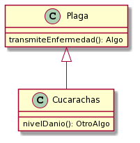

# Documentando un programa Wollok

El objetivo de este ejercicio es comenzar a ejercitar la idea de _documentar_ un diseño, partiendo en este caso de una implementación existente. Dejamos el enunciado original en [otro archivo](./dominio.md) por si necesitan consultarlo.

Para este primer ejercicio, les vamos a pedir que documenten algunas cosas directamente sobre el código y otras en este README.

**Sobre el código:**

* especificar el _tipo_ de todos los parámetros;
* para los métodos que _devuelven_ algo, indicar de qué tipo es lo que devuelve;
* para los métodos que son _acciones_ y no devuelven nada, especificar exactamente eso (con un comentario que diga "no devuelve nada" o similar).

**En este README:**

Elaborar e incluir aquí diagramas de clase para esta implementación, con dos variantes posibles:
* un solo diagrama con todas las clases,
* tres diagramas distintos: uno para las plagas, otro para los elementos, otro para el barrio.

En ambos casos, incluir solamente los métodos y atributos que consideren importantes para que alguien que no conoce el dominio ni el código pueda entender el diseño. En la sección [software](https://obj2-unahur.github.io/software) del sitio de la materia tienen algunas herramientas que pueden resultar útiles para elaborar los diagramas.

Y de yapa, dos ejemplos de cómo incluir una imagen en Markdown (vean este archivo desde un editor para notar la diferencia):

**Subida de diagramas**

Barrio-

Elementos-

Plagas-

